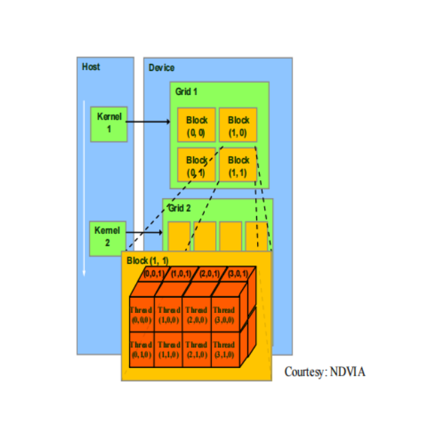

# Homework 1.1

## 流水线前传机制
通过调研计算机体系结构的书籍，深入理解流水线前传机制，以及该机制如何使CPU的效率显著增加

答：在书籍资料中没有找到 “流水线前传” 这样的说法，我猜测所谓流水线前传是否对应着 “Operand Forwarding” 也就是操作数前传。其背景应该是流水线结构的引入，一定程度上提高了CPU的通量，但是也带来了所谓的“冒险问题”。对于数据冒险来说，是下一个步骤已经准备好，但依赖上一个步骤的数据还没有写入存储。应对的方法一个是等待，另一个就是说“操作数前传”，让上一个步骤的结果可以不用回写寄存器而是直接作为操作数送入下一个步骤。


## CPU的三级缓存
CPU中的三级缓存的特点是什么，哪些内容适合放在哪一级别的缓存上

答：
- 速度 L1 > L2 > L3
- 容量 L1 < L2 < L3

除此之外，对于多核处理起来说，L2 or L3 可能是被多核共享的。因此总的来说，存取频率越高的内容，越适合放在靠近CPU的高速缓存上。


## 什么样的问题适合GPU
思考自己日常编程解决的任务中，哪些适合叫个GPU处理？

答：矩阵运算，图像和点云处理


# Homework 1.2

## 线程束warp
GPU的控制单元和计算单元是如何结合的，或者说warp线程束是如何在软件和硬件端被执行的，为什么说线程束是执行核函数的基本单元

答：
GPU使用一个控制单元来控制多组同样的计算单元，输入不同的数据，进行同步计算，提高计算通量。也就是所谓的SIMD（Single Instruction Multiple Data)。至于 warp包含 32个并行线程，作为执行核函数基本单元，应该是硬件设计特性上决定的。也就是一组最小的SIMD硬件单元，支持32个并行线程。

从nvidia官方文档中找到了以下两端话：

> Individual threads composing a warp start together at the same program address, but they have their own instruction address counter and register state and are therefore free to branch and execute independently.

> A warp executes one common instruction at a time, so full efficiency is realized when all 32 threads of a warp agree on their execution path. If threads of a warp diverge via a data-dependent conditional branch, the warp executes each branch path taken, disabling threads that are not on that path. Branch divergence occurs only within a warp; different warps execute independently regardless of whether they are executing common or disjoint code paths.

从这两段话可以看出，虽然GPU上的任务基本上是按照线程束来调度和执行的，但是线程束中的每一个线程仍然拥有自己的指令地址和状态寄存器，一个线程束中间的线程可以执行不同的代码路径，但如果其中一个线程出现代码分叉（A or B），会导致warp控制器执行完整的 A + B 的代码路径，并在对应路径上禁用相应的线程，从而大大降低并行效率。


## 线程ID
计算下图Thread（3,0,0) 的线程ID


答：

按照三维的划分方法
```
thread_id_x = 1 * 4 + 3 = 7
thread_id_y = 1 * 2 + 0 = 2
thread_id_z = 0 * 2 + 0 = 0
```