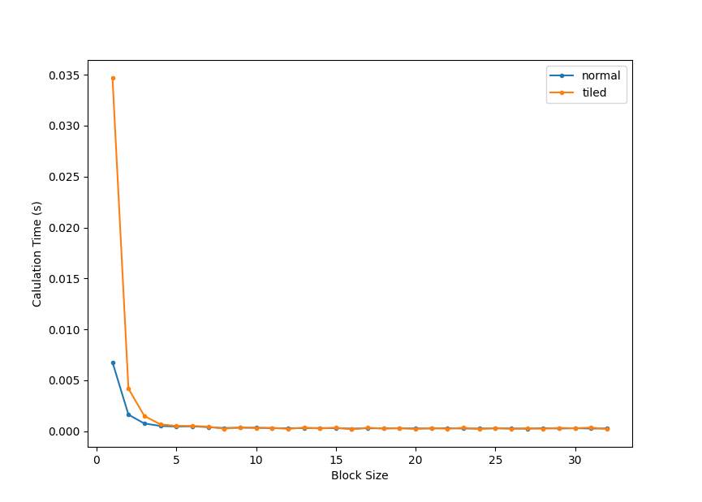
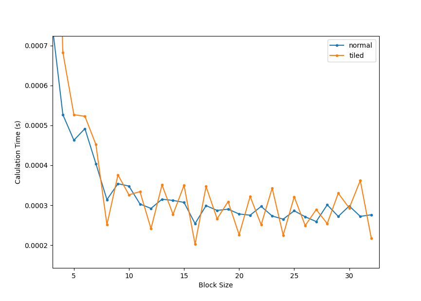

# Cuda Course Homework for Chapter 2

## 测试环境

- 硬件：AMD 5900hx + GTX 3080 Laptop
- 软件：ubuntu 20.04 + Nvidia Driver 510 + CUDA 11.6

通过CUDA例程中的deviceQuery查询到实验用电脑的GPU的一些主要参数如下：

```txt
Device 0: "NVIDIA GeForce RTX 3080 Laptop GPU"
  CUDA Capability Major/Minor version number:    8.6
  (48) Multiprocessors, (128) CUDA Cores/MP:     6144 CUDA Cores
  Total amount of shared memory per block:       49152 bytes
  Total number of registers available per block: 65536
  Maximum number of threads per multiprocessor:  1536
  Maximum number of threads per block:           1024
```  

此外，通过[CUDA C Progamming Guide](https://docs.nvidia.com/cuda/cuda-c-programming-guide/)中，还查到对于 8.6 计算架构的GPU，还有如下限制：
 ```
 Total shared memory per SM:                  102400 bytes (100 KB)
 Total amount of registers per SM:            65536 (64K)
 ```

以上GPU计算单元的资源限制，可能会在不同的Block划分逻辑下，对计算的效率产生影响。

## 例程修改
- 对于分 Tile 计算的方法来说，TileSize必须和BlockSize一致，否则Block内的线程无法获取到所需要Tile内的全部数据，得不到正确的计算结果
- 在电脑上发现偶尔会得出不太一致的计算时间（特别针对小计算量），因此之后的时间统计均改成 100 次计算取平均值

## 课后题解答

## 1. Calculation time comparison of different method

|                          |      64*64       |      512*512     |
|--------------------------|------------------|------------------|
| CPU(AMD 5900hx)          |   0.000715 (s)   |   0.359700 (s)   |
| GPU_Origin (3080 Laptop) |   0.000010 (s)   |   0.000254 (s)   |
| GPU_Tiles (3080 Laptop)  |   0.000015 (s)   |   0.000202 (s)   |

*以上block_size 均设置为: (16, 16)*

从结果上看，在较小矩阵维度下，使用分Tile访问共享内存的计算方式不一定带来性能提升，而当矩阵维度扩大时则效果则显示出来。

## 2. Block size balance
从Tiled矩阵乘法使用共享内存的原理上说，TiledSize越大，相对来说，从共享内存里读取内存的次数相比从L2 Cache或者显存越多，理论上获得更好的性能。而在这种计算方法中，需要保持 TiledSize 和 BlockSize 一致，而BlockSize又会通过如下方式影响最终的计算性能：
1. 单个Block中的线程个数如果特别少（如1个），由于每个SM能够容纳Block数量的限制（16个），会导致单个SM上的并行计算线程能力不能被完全发挥（实际可以容纳1536个线程，最终只容纳16个线程），因此单个Block内线程数量最好大于(1536/16 = 96)。
2. 由于Block中的线程按照Warp被调度，理论上当Block内的线程数量是 32 的倍数时（不确定应该是32的倍数还是32*4=128的倍数），能够最大化SM的线程处理能力。
3. 由于我的GPU上单个SM被限制 1536 个线程，所以当单个Block内的线程数量恰好能让 1536 整除时，能够最大利用单个SM的线程容纳能力。
4. CUDA计算框架限制单个Block内最多1024个线程。

所以我的推测，在内存带宽没有成为瓶颈的情况下，如果又能满足以上条件，则BlockSize越大，Tiled矩阵乘法的计算耗时会越短。而完全满足以上BlockSize的只有一个数字**16**。

实际测试结果如下图所示，可以看到：
- 计算耗时在 BlockSize处于 1 - 8 左右的时候有着明显的下降
- Tiled 耗时在 BlockSize 8 之后基本没有了下降趋势，而是上下波动，这可能跟Thread排布各种整数倍的约束条件有关
- 耗时最短的 BlockSize 是 16




